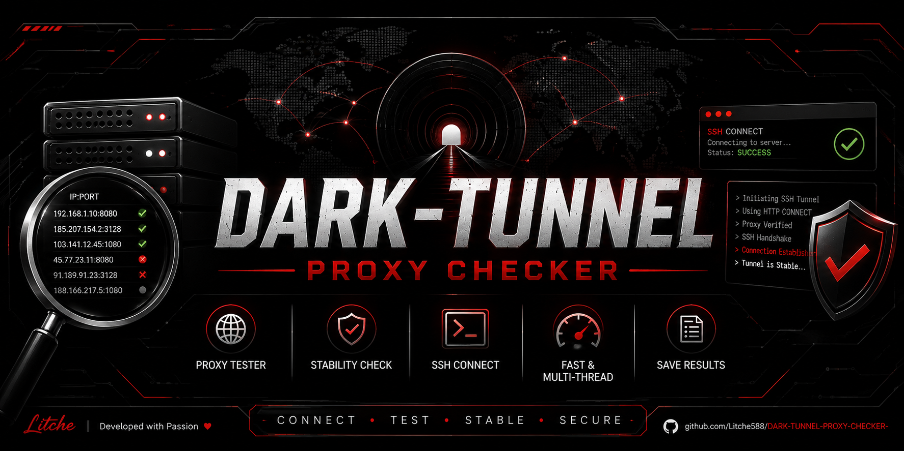

<div align="center">

<a href="https://github.com/Litche588/DARK-TUNNEL-PROXY-CHECKER-">
  
</a>

<br><br>


<h1>DARK-TUNNEL-PROXY-CHECKER</h1>

<p>Fast & Multi-Threaded Proxy Stability Checker</p>

</div>
# 🖤 Litche Dark Tunnel Proxy Checker

أداة بسيطة وسريعة لفحص **استقرار البروكسيات** واختبار إمكانية استخدامها مع اتصالات SSH، مع دعم فحص عدد كبير من البروكسيات بشكل متزامن.

تم تطوير الأداة بواسطة **Litche**.

> ⚠️ **تنبيه:** استخدم الأداة فقط على البروكسيات والأنظمة التي تملكها أو لديك تصريح لاختبارها.

---

##  🇵🇸 الوصف

**Litche Dark Tunnel Proxy Checker** 
مخصصة لفحص قائمة من البروكسيات واكتشاف البروكسيات التي تستجيب لاتصال **method:CONNECT**
وتستطيع الوصول إلى SSH Host المحدد.

الأداة تقوم بـ:

* قراءة البروكسيات من ملف.
* اختبار الاتصال بكل Proxy.
* إرسال طلب `CONNECT`.
* التحقق من استجابة HTTP `200`.
* التحقق من وجود استجابة SSH.
* اختبار استمرار الاتصال.
* حساب زمن الاستجابة التقريبي.
* استخدام عدة Threads لتسريع الفحص.
* حفظ البروكسيات التي اجتازت الاختبار في ملف منفصل.

> ملاحظة: بعض البروكسيات قد تعتمد على إعدادات الشبكة أو مزود الخدمة، لذلك قد تختلف النتيجة من شبكة إلى أخرى. في بعض الحالات قد تحتاج بعض البروكسيات إلى إعادة الاتصال بالشبكة أو تفعيل وضع الطيران ثم إيقافه.

---

# ✨ المميزات

* 🚀 فحص متعدد الخيوط.
* ⚡ فحص سريع لعدد كبير من البروكسيات.
* 🔌 اختبار اتصال HTTP CONNECT.
* 🔐 اختبار الوصول إلى SSH.
* 📊 حساب Latency.
* 💾 حفظ البروكسيات الناجحة تلقائياً.
* 📱 يعمل على Termux.
* 🐧 يعمل على Linux.
* 🐉 يعمل على Kali Linux.
* 🐍 يعتمد على Python القياسي فقط.

---

# 📋 المتطلبات

الأداة تحتاج فقط إلى:

* Python 3
* اتصال بالشبكة
* ملف يحتوي على البروكسيات

ولا تحتاج إلى تثبيت مكتبات Python خارجية.

المكتبات المستخدمة كلها من Python Standard Library:

```text
socket
time
concurrent.futures
argparse
```

---

# 🐧 التثبيت على Linux

## Debian / Ubuntu

قم بتثبيت Python:

```bash
sudo apt update
sudo apt install python3 -y
```

تحقق من الإصدار:

```bash
python3 --version
```

استنساخ المشروع:

```bash
git clone https://github.com/Litche588/DARK-TUNNEL-PROXY-CHECKER-.git
cd DARK-TUNNEL-PROXY-CHECKER-
```

ثم شغّل الأداة:

```bash
python3 script.py --help
```

---

# 🐉 التثبيت على Kali Linux

تثبيت Python:

```bash
sudo apt update
sudo apt install python3 -y
```

يمكنك أيضاً تثبيت Git إذا لم يكن موجوداً:

```bash
sudo apt install git -y
```

استنساخ المشروع:

```bash
git clone https://github.com/Litche588/DARK-TUNNEL-PROXY-CHECKER-.git
cd DARK-TUNNEL-PROXY-CHECKER-
```

اختبار الأداة:

```bash
python3 script.py --help
```

لا تحتاج إلى:

```bash
pip install
```

لأن الأداة تعتمد على مكتبات Python القياسية فقط.

---

# 📱 Termux

تثبيت Python:

```bash
pkg update -y
pkg install python git -y
```

استنساخ المشروع:

```bash
git clone https://github.com/Litche588/DARK-TUNNEL-PROXY-CHECKER-.git
cd DARK-TUNNEL-PROXY-CHECKER-
```

تشغيل المساعدة:

```bash
python3 script.py --help
```

---

# 📄 تجهيز ملف البروكسيات

أنشئ ملفاً مثلاً:

```text
proxies.txt
```

ضع فيه Proxy واحد في كل سطر:

```text
127.0.0.1:8080
192.168.1.10:3128
10.0.0.5:8080
```

صيغة الإدخال المطلوبة:

```text
IP:PORT
```

مثال:

```text
195.133.65.238:10909
78.29.53.117:1080
151.115.99.193:10006
31.168.143.90:1080
```

---

# 🚀 الاستخدام

الصيغة العامة:

```bash
python3 script.py -h <SSH_HOST> -p <SSH_PORT> -w <PROXY_FILE>
```

مثال:

```bash
python3 script.py -h fr1.sshtun.site -p 80 -w proxies.txt
```

### الخيارات

| الخيار   | الوصف          |
| -------- | -------------- |
| `-h`     | عنوان SSH Host |
| `-p`     | منفذ SSH       |
| `-w`     | ملف البروكسيات |
| `--help` | عرض المساعدة   |

---

# 💾 النتائج

بعد انتهاء الفحص سيتم إنشاء:

```text
dark_tunnel_stable.txt
```

ويحتوي الملف على البروكسيات التي اجتازت الاختبارات:

```text
IP:PORT
IP:PORT
IP:PORT
```

---

# 📊 مثال على الناتج

```text
╔══════════════════════════════════════════════════════════════╗
║                  LITCHE DARK TUNNEL                          ║
║                  PROXY CHECKER                               ║
╚══════════════════════════════════════════════════════════════╝

[*] Host      : fr1.sshtun.site
[*] Port      : 80
[*] Proxies   : 500
[*] Threads   : 30

[*] Starting proxy stability scan...

[+] Stable -> 192.168.1.10:8080 | Latency: 4210ms
[+] Stable -> 10.0.0.5:3128    | Latency: 4351ms

[+] Stable proxies : 2
[+] Saved to       : dark_tunnel_stable.txt
```

---

# ⚙️ إعدادات الفحص

يمكن تعديل بعض الإعدادات من داخل `script.py`:

```python
TIMEOUT = 5
MAX_THREADS = 30
```

### TIMEOUT

المدة القصوى لمحاولة الاتصال:

```python
TIMEOUT = 5
```

### MAX_THREADS

عدد عمليات الفحص المتزامنة:

```python
MAX_THREADS = 30
```

يمكن زيادة العدد، ولكن القيمة المناسبة تعتمد على جهازك والشبكة.

---

# 📁 هيكل المشروع

```text
Litche-Dark-Tunnel/
│
├── script.py
├── proxies.txt
├── dark_tunnel_stable.txt
├── README.md
└── LICENSE
```

---

# ⚠️ ملاحظات

نتيجة الاختبار تعتمد على عدة عوامل، منها:

* جودة البروكسي.
* حالة البروكسي في وقت الفحص.
* الشبكة المستخدمة.
* مزود خدمة الإنترنت.
* إعدادات البروكسي.
* إعدادات SSH.
* Firewall أو Filtering.

لذلك فإن ظهور Proxy على أنه مستقر أثناء الفحص لا يعني أنه سيبقى مستقراً إلى الأبد.

كما أن بعض البروكسيات قد تعمل فقط في ظروف شبكة معينة، وقد تحتاج إلى إعادة الاتصال بالشبكة أو تفعيل وضع الطيران ثم إيقافه.

---

# 🔐 الاستخدام المسؤول

هذه الأداة مخصصة للاختبار المشروع والبحث الأمني المصرح به.

لا تستخدمها للوصول غير المصرح به إلى أنظمة أو شبكات أو خدمات لا تملك إذناً باختبارها.

المستخدم مسؤول عن طريقة استخدام الأداة.

---

# 👤 المطور

**Litche**

Telegram Group:

https://t.me/DZCONFI

Telegram:

@litcheeeee

---

# 🇬🇧 English

## 🖤 Litche Dark Tunnel Proxy Checker

A lightweight Python tool designed to test **proxy stability** and check whether proxies can establish a CONNECT-based connection to a specified SSH host.

Developed by **Litche**.

> ⚠️ **Disclaimer:** Only use this tool with proxies, systems, and networks that you own or have explicit permission to test.

---

## ✨ Features

* 🚀 Multi-threaded proxy scanning.
* ⚡ Fast testing of large proxy lists.
* 🔌 HTTP CONNECT testing.
* 🔐 SSH response verification.
* 📊 Approximate latency measurement.
* 💾 Automatically saves working proxies.
* 📱 Termux compatible.
* 🐧 Linux compatible.
* 🐉 Kali Linux compatible.
* 🐍 Uses only Python Standard Library modules.

---

## 📋 Requirements

You only need:

* Python 3
* Network connection
* A proxy list

No external Python packages are required.

The tool uses Python's built-in modules:

```text
socket
time
concurrent.futures
argparse
```

---

## 🐧 Linux Installation

### Debian / Ubuntu

```bash
sudo apt update
sudo apt install python3 -y
```

Clone the repository:

```bash
git clone https://github.com/YOUR_USERNAME/YOUR_REPOSITORY.git
cd YOUR_REPOSITORY
```

Run:

```bash
python3 script.py --help
```

---

## 🐉 Kali Linux Installation

Install Python and Git:

```bash
sudo apt update
sudo apt install python3 git -y
```

Clone the repository:

```bash
git clone https://github.com/YOUR_USERNAME/YOUR_REPOSITORY.git
cd YOUR_REPOSITORY
```

Run:

```bash
python3 script.py --help
```

No `pip install` is required.

---

## 📱 Termux Installation

```bash
pkg update -y
pkg install python git -y
```

Clone:

```bash
git clone https://github.com/YOUR_USERNAME/YOUR_REPOSITORY.git
cd YOUR_REPOSITORY
```

Run:

```bash
python3 script.py --help
```

---

## 📄 Proxy List Format

Create:

```text
proxies.txt
```

Add one proxy per line:

```text
IP:PORT
```

Example:

```text
195.133.65.238:10909
78.29.53.117:1080
151.115.99.193:10006
31.168.143.90:1080
```

---

## 🚀 Usage

General syntax:

```bash
python3 script.py -h <SSH_HOST> -p <SSH_PORT> -w <PROXY_FILE>
```

Example:

```bash
python3 script.py -h fr1.sshtun.site -p 80 -w proxies.txt
```

### Arguments

```text
-h, --host       SSH Host
-p, --port       SSH Port
-w, --wordlist   Proxy list
--help           Show help
```

---

## 💾 Output

Working proxies are saved automatically to:

```text
dark_tunnel_stable.txt
```

Example:

```text
195.133.65.238:10909
78.29.53.117:1080
```

---

## ⚙️ Configuration

You can change the following settings inside `script.py`:

```python
TIMEOUT = 5
MAX_THREADS = 30
```

`TIMEOUT` controls the connection timeout.

`MAX_THREADS` controls the number of concurrent workers.

---

## 👤 Developer

**Litche**

Telegram Group:

https://t.me/DZCONFI

Telegram:

https://web.telegram.org/k/#@litcheeeee

---

## ⭐ Support

If you find the project useful, consider giving the repository a ⭐ on GitHub.

Feel free to report bugs, suggest improvements, or contribute to the project.
